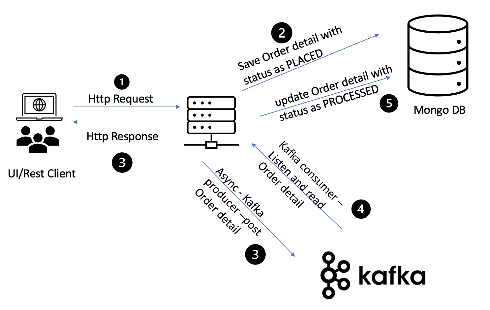

# Order Management System [](https://forthebadge.com/images/badges/made-with-java.svg)

This application handles the order creation and other order related operations.

## Architecture



 ## Quickstart Guide
 ### Prerequisites
 #### Local Setup
 - Download any IDE that work with Gradle and Springboot
 - Install MongoDb
    - [setup](https://docs.mongodb.com/manual/tutorial/install-mongodb-on-os-x/) local mongodb
    - Create database named `orders` and collection named `orderDetails`
 - Install Kafka
   - Install zookeeper and kakfa
   - Run the below command to create topic
     - `
    kafka-topics --create --zookeeper localhost:2181 --replication-factor 1 --partitions 1 --topic order-details
    `
   - Run the below commands to start zookeeper and kafka
    ```
    zookeeper-server-start /usr/local/etc/kafka/zookeeper.properties
    kafka-server-start /usr/local/etc/kafka/server.properties
   ```
   
  #### TechStack
   - Java
   - Springboot
   - Kafka
   - MongoDb
   
 #### Testing
  **Note: (Please find the Postman_collection.json in this repo for all endpoints samples)**
  
  ##### OpenAPI spec available at - http://localhost:8090/order_management/v1/api-docs
  
  ##### Order creation:
  
  ```$xslt
curl -X POST \
  http://localhost:8090/order_management/v1/orders/ \
  -H 'content-type: application/json' \
  -H 'x-auth-token: 40d7339f-006d-4918-bdb0-1743f31b6da5' \
  -d '{
	"customerName": "Rekha",
	"address" : "TamilNadu",
    "contactNo" : "9876543210",
    "orderStatus" : "PLACED",
    "productDetails" :[{
    	"productId" : "123",
    	"category" : "decor",
    	"price" : 2010.50
    },
    {
    	"productId" : "1768",
    	"category" : "kitchen",
    	"price" : 7010.50
    }
    ]
}'
```

**Sample Response:** 
 - Unique Order Id is generated
 - Total price is calculated
 
 ```$xslt
{
    "orderId": "6a1f7139-dd32-465d-9625-3acb324eb892",
    "createdTimestamp": "2021-09-25 11:10:28 UTC",
    "updatedTimestamp": "2021-09-25 11:10:28 UTC",
    "customerName": "Rekha",
    "address": "TamilNadu",
    "contactNo": "9876543210",
    "orderStatus": "PLACED",
    "productDetails": [
        {
            "productId": "123",
            "category": "decor",
            "price": 2010.5
        },
        {
            "productId": "1768",
            "category": "kitchen",
            "price": 7010.5
        }
    ],
    "totalPrice": 9021
}
```

##### get order Details: (status would change from PLACED to PROCESSED)

**Request:**

```$xslt
curl -X GET \
  http://localhost:8090/order_management/v1/orders/6a1f7139-dd32-465d-9625-3acb324eb892 \
  -H 'x-auth-token: 40d7339f-006d-4918-bdb0-1743f31b6da5'
```

**Response:**

```$xslt
{
    "orderId": "6a1f7139-dd32-465d-9625-3acb324eb892",
    "createdTimestamp": "2021-09-25 11:10:28 UTC",
    "updatedTimestamp": "2021-09-25 11:10:35 UTC",
    "customerName": "Rekha",
    "address": "TamilNadu",
    "contactNo": "9876543210",
    "orderStatus": "PROCESSED",
    "productDetails": [
        {
            "productId": "123",
            "category": "decor",
            "price": 2010.5
        },
        {
            "productId": "1768",
            "category": "kitchen",
            "price": 7010.5
        }
    ],
    "totalPrice": 9021
}
```


 